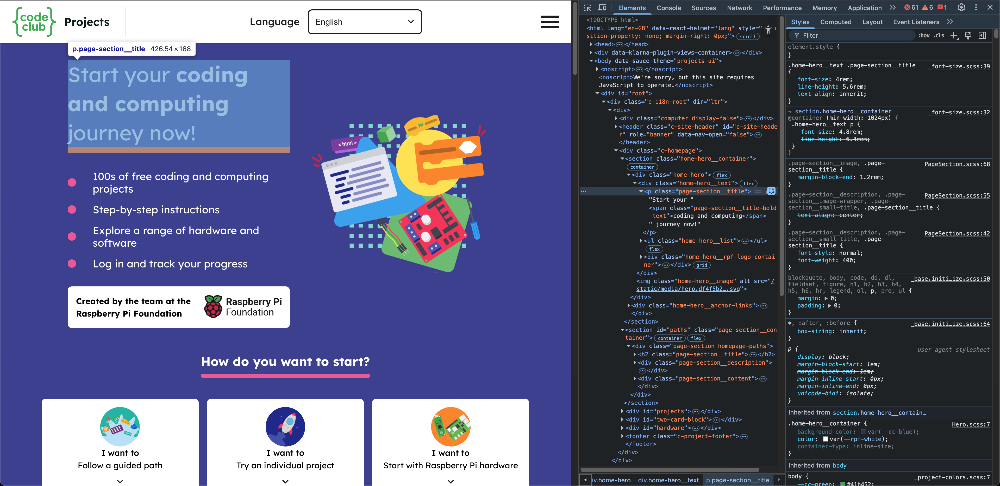
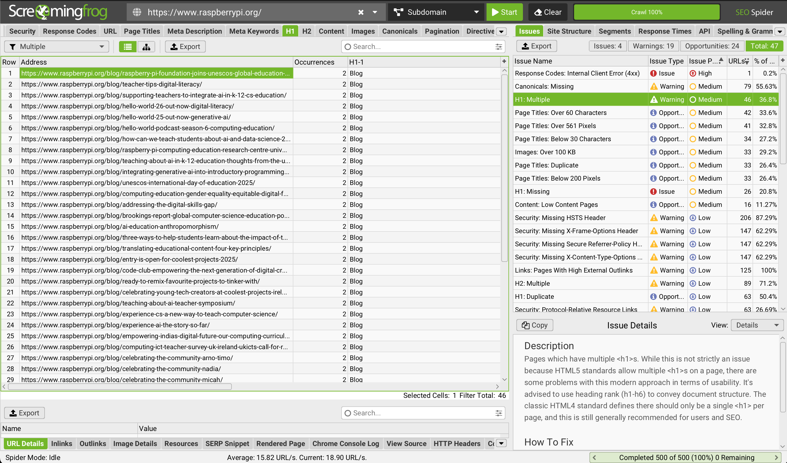
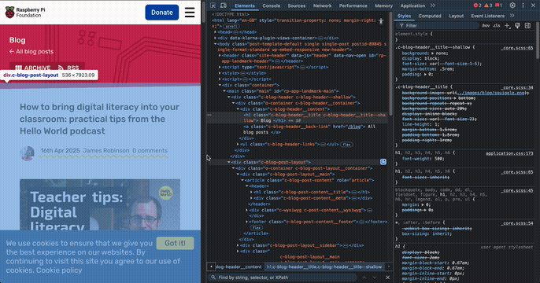
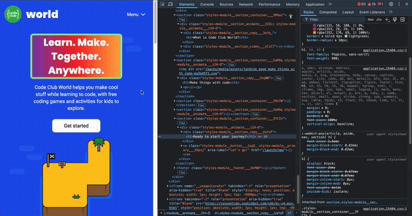

# Welcome To Henry's Raspberry-Pi Website Audit

## Introduction

👋 Hi There!

Thanks for following the link to my super-special personal website audit that I put together for you.

### What is this?
I wanted to convey just how enthusiastic I am about applying for the position of "Software Engineer at Raspberry-Pi". My way of showing this was to present what I'm bringing to the table. Not just technical skills, but enthusiasm and dedication. A willingness to go above and beyond. 

Whilst doing my research on the job position and the company, I did some digging and dev-sleuthing on the Raspberry-Pi websites. I've created a personal presentation for you based on some of the things I've found.

**Please read:** Before I continue, I would like to state that I never intended to step on anyone's toes with the information I am about to present. It should not be taken as harsh criticism or a judgement of any kind. I believe that the good people already working on the sites at Raspberry-Pi (that I hope to join the ranks of) are doing an incredible job. This audit is just my attempt an enthusiastic attempt to put myself ahead of the competition!

### Nice enthusiasm! That sounds great, so what am I about to read?
The featured information on this page will be broken down into the following categories:
- SEO
- Technical Performance
- UX
- Content Quality
- Security

With each finding I will explain where I found them, present my understanding of the issue, and my own recommended suggestion.

I'm hopeful that if I'm successful in my application to join the team at Raspberry-Pi, I might get the opportunity to tackle these issues and really put my money where my mouth is!

### What's the scope of this audit?
All of the information I've gathered I found by personally inspecting the following domains and some of the related subdomains.

- https://www.raspberrypi.com/
- https://www.raspberrypi.org/
- https://projects.raspberrypi.org/ 
- https://codeclub.org/
- https://codeclubworld.org/
- https://astro-pi.org/
- https://experience-ai.org/

I understand that some of these domains are operated under the Raspberry-Pi foundation whilst others will be Raspberry-Pi LTD, and will not necessarily have oversight over each other but for the purposes of this demonstration I included them all in a naive attempt to find as many things as I could.

### Before we begin...

I'd like to say that I think the websites built and operated by the teams at Raspberry-Pi are incredible examples of clean, well crafted and carefully considered web design. Every page I encountered was a gleaming example of great HTML semantics, structure, accessibility practices, and SEO design. I had to look long and hard to find anything at all that I could even consider a potential bug/issue that needed fixing. So firstly everyone involved deserves a round of applause!

Saying that, I had to write about something here so let's get started!

## Audit

### 1. SEO

For this section I used the [SiteOne Crawler Report tool](https://crawler.siteone.io/), [Screaming Frog SEO Spider](https://www.screamingfrog.co.uk/seo-spider/), Chrome Lighthouse reports as well as manually inspecting the pages.

Overall I found most sites had exemplary scores on SEO performance. Across the board most sites scored 100 with Lighthouse! The only issues I picked up are mostly minor. It might seem a bit nit-picky, but I wanted to include them to show the degree of detail that I pay attention to. 

<p style="font-size: 24px; font-weight: bold"> Henry's Score: 9/10 </p>

##### Missing H1 Tag
Found on https://projects.raspberrypi.org/en

**Problem:** H1 tags signify the primary topic of a page to search engines. As this is the landing page for this site it will have a negative impact on how the page is indexed and ranked. Whilst modern search engines can mostly mitigate this issue, it's a best practice to ensure only one H1 tag is in place per page.
<p align="center"></p>

**Solution:** Replace the `<p/>` tag with the class "page-section__title" with a `<h1/>` tag

**Bonus:** The screamingfrog seo crawler results showed that the raspberrypi.org blog has occurrences of multiple H1 tags on every blog article it found.

<p align="center"></p>

When inspecting the page it appears that the blog page container has it's own sub-header with the text "Blog". As this is set to `<h1/>` tag it conflicts with the heading on each article. My personal recommendation would be to change the sub-header to a tag with less hierarchical value. 

<p align="center"></p>


##### Multiple H1 Tags
Found on https://codeclubworld.org/

**Problem:** Web crawlers won't be able to determine what the primary subject of the page is and will affect indexing/ranking. This also impacts screenreaders that help visually impaired readers to navigate the page

<p align="center"></p>

**Solution:** Ensure the primary heading of the page is enclosed within a `<h1/>` tag and that subsequent headings are given tags of the right hierarchical value.

##### Missing Meta Description
Found on https://codeclub.org/en

**Problem:** The only description `Meta` tag on this page targets the OpenGraph protocol `og:description`. This tag would be used for page summaries on social media platforms such as Facebook, LinkedIn etc. Whilst it is necessary, it serves a different purpose to the regular `name="description"` Meta tag, which will be used by search engines.

```html
<meta content="We believe in learning through making, and Code Clubs use our free coding projects and resources to offer young people plenty of opportunities to be creative, learn a new skill and connect with others." property="og:description">
```

**Solution:** Simply duplicate the tag in the head and change `property="og:description"` to `name="description"`. Like so:

```html
<meta name="description" content="We believe in learning through making, and Code Clubs use our free coding projects and resources to offer young people plenty of opportunities to be creative, learn a new skill and connect with others.">
```

##### Non Descriptive Link Texts

Found on https://codeclub.org/en

**Problem:** The [Google Dev Docs](https://developer.chrome.com/docs/lighthouse/seo/link-text/?utm_source=lighthouse&utm_medium=devtools) outline the issue in detail. Put simply, when the displayed text inside of a link isn't descriptive, both users & search engines won't necessarily understand the relation between the pages being linked.

<p align="center"></p>

**Solution:** This task may require some tweaking depending on how the articles are titled, but the fix is simple: include some relevant information in the link description like so:

```html
<a href="article-url">Read more about [Article Title]</a>
```


