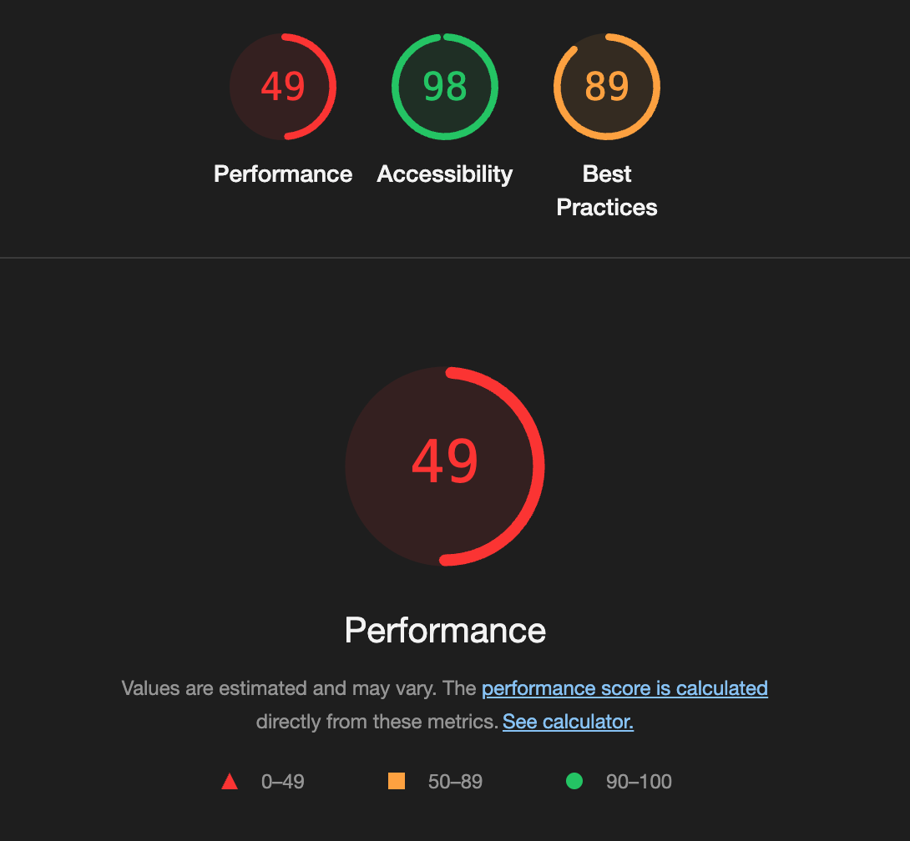
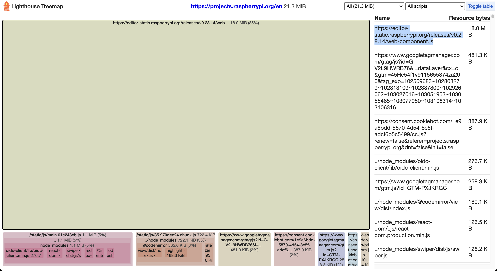
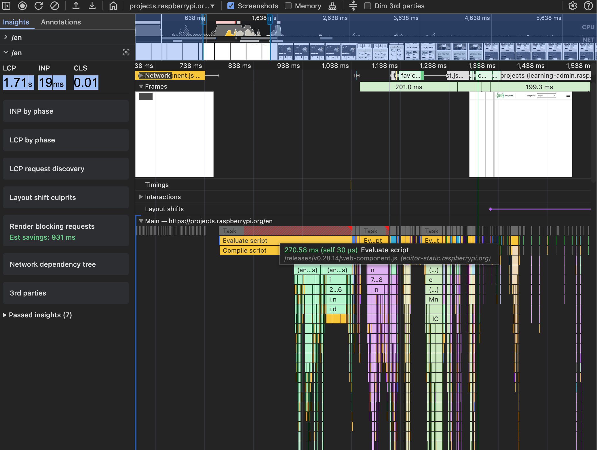
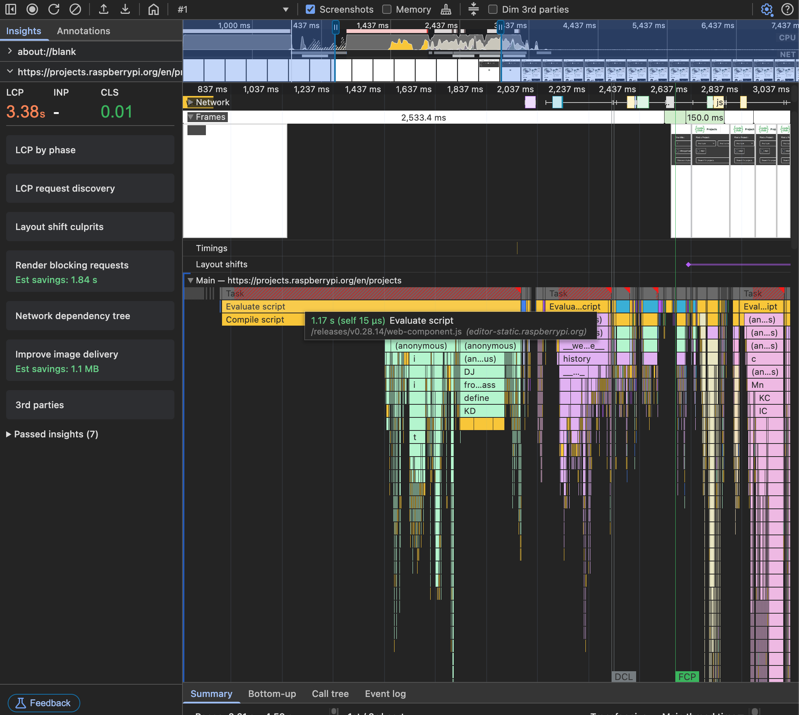
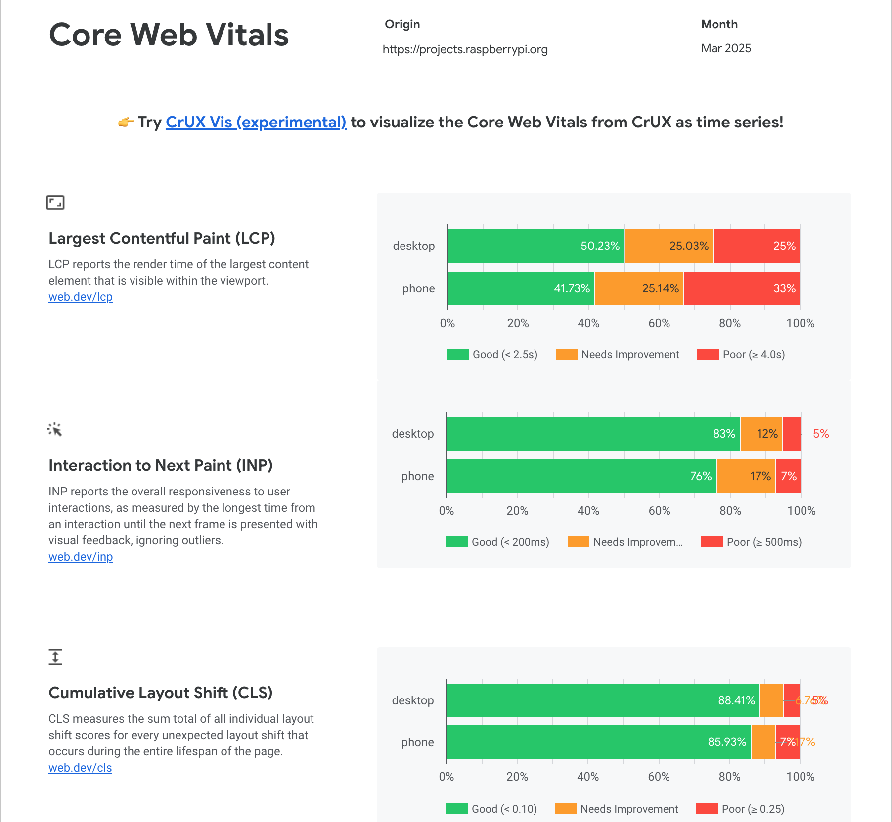
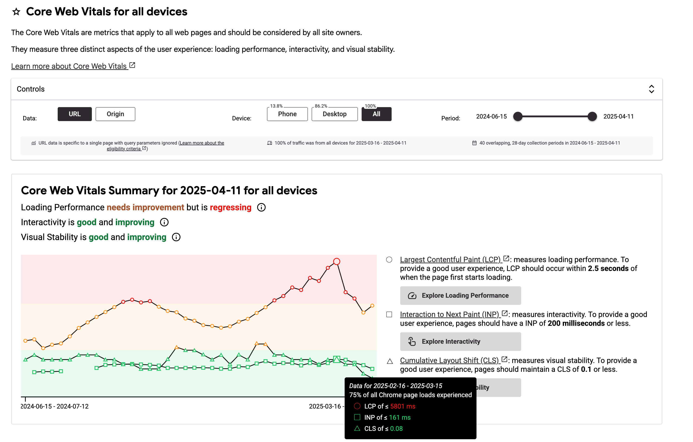
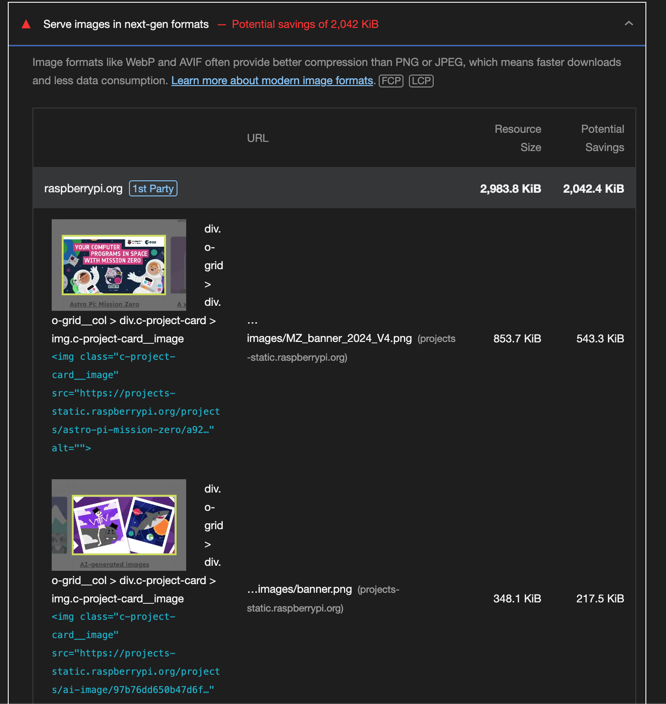

### What am I looking at here? 🤔
Welcome to Henry's Raspberry-Pi Website Audit! 🕵️

I’m genuinely excited about applying for the Software Engineer role at Raspberry Pi. To show what I bring—not just technical skills but enthusiasm and dedication—I’ve put together this personal audit as a way of demonstrating my willingness to go above and beyond.

While researching the role and the company, I used my frontend development experience and deep knowledge of Web Vitals to explore the Raspberry Pi Foundation and LLC websites. This presentation highlights what I observed and some ideas for improvement.

**A quick note:** My intention isn’t to criticize or judge. I have great respect for the talented team already working on these sites. This audit is simply my way of demonstrating passion and going the extra mile to stand out!


### Love the enthusiasm! How does this work? 
The featured information on this page will be broken down into the following categories:

- Technical Performance
- GDPR
- Security
- SEO
- UX

For each issue I present, I'll explain where I found it, provide context on the problem, and offer a suggested solution.

If I'm successful in joining the Raspberry Pi team, I'm excited to tackle these challenges and put my ideas into action!

### What's the scope of this audit? 🔎
All of the information I've gathered I found by personally inspecting the following domains and some of the related subdomains.

- https://www.raspberrypi.com/
- https://www.raspberrypi.org/
- https://projects.raspberrypi.org/ 
- https://codeclub.org/
- https://codeclubworld.org/
- https://astro-pi.org/
- https://experience-ai.org/

I understand that some of the domains I reviewed are operated by the Raspberry Pi Foundation, while others belong to Raspberry Pi Ltd. These entities operate independently and don’t necessarily have oversight over each other. However, for the purpose of this audit, I included all related websites in a broad, exploratory effort to identify as many opportunities for improvement as possible.

### Before we begin...

I want to acknowledge the impressive work done by the teams at Raspberry Pi. Their websites are exemplary models of clean design, solid HTML structure, accessibility, and SEO practices. Every page I visited showcased great attention to detail, making it a challenge to find areas for improvement. Kudos to everyone involved!

Of course, I needed to identify some points for discussion, so let’s dive in!

---

<h2 class="audit" id="audit">The Audit</h2>

As I delve into this audit, I want to acknowledge the complexity of managing a diverse range of websites, from storefronts to blogs and educational platforms. Each decision behind their development likely has its rationale, which I may not be aware of from my external perspective.

The following points are based on a surface-level examination and should be viewed as a demonstration of my skills rather than a critique. My goal is to provide constructive insights, not to imply any shortcomings in the current setup.

## 1. Technical Performance ⚙️

First off, let me just say: Wow! The average Lighthouse scores across most of the sites I reviewed were truly impressive—mostly in the 95% range! Great job 👏 It took some patience and tenacity, but I did manage to find a few standout issues worth mentioning.


The data I used comes from two sources. First, I ran lab-based audits using Chrome Lighthouse. I’m aware that Lighthouse lab data can sometimes give a skewed view of real-world performance since it simulates conditions in a controlled environment. To balance that, I also analyzed anonymous user experience data from Google’s Chrome User Experience Report [(CrUX)](https://developer.chrome.com/docs/crux), which reflects real user metrics collected from millions of Chrome users in the wild.


### Large Resources Blocking Render Time

<p class="found">Discovered on: https://projects.raspberrypi.org/en</p>


<figure align="center"><figcaption>Uh-oh!</figcaption></figure>

**Problem:**  
Large resources requested during page load can block the browser from rendering visible content until fully downloaded, parsed, and executed. On the landing page for [projects.raspberrypi.org](https://projects.raspberrypi.org), one of the earliest loaded resources is:

`https://editor-static.raspberrypi.org/releases/v0.28.14/web-component.js`

According to the Lighthouse Treemap tool, this file is a massive **18 MB**—a size that can significantly delay page rendering.

#### What is this file?

My research led to me the conclusion that this script is the Raspberry Pi Code Editor web component, as detailed in the [editor-ui GitHub repository](https://github.com/RaspberryPiFoundation/editor-ui). providing a modular, embeddable code editor that other sites can integrate using the `<editor-wc>` custom element.

<figure align="center"><figcaption>18mb Resource</figcaption></figure>


What I noticed was that the resource is loaded on every page, including the landing page, regardless of a need for the editor or not. On a lot of modern, powerful devices with good internet speeds the loading time for the page may be negligible, but this could really impact the user experience for someone using an older / inexperienced device. Considering that this is a primary website for education it would be a huge shame for any user to be disadvantaged by painfully slow rendering times!

**Solution:**  
Without full insight into the component's inner workings, I can only offer assumption-based suggestions to improve resource loading, assuming optimizations aren't already in place:

1. **Defer loading** by lazy-loading the script only when absolutely necessary. This can significantly reduce initial page render time. If the script isn’t critical for first render, simply adding the `async` or `defer` attributes to the `<script>` tag can help, as explained in the [Chrome Developer Docs](https://developer.chrome.com/docs/lighthouse/performance/render-blocking-resources/?utm_source=lighthouse&utm_medium=devtools#how_to_eliminate_render-blocking_scripts).

2. **Code-splitting:** Given the file's large size, splitting it into smaller chunks that load on demand can greatly improve performance.

3. **Proper caching:** Ensure the file is cached effectively to avoid impacting repeat page loads. While inspecting the network request, I noticed the file size drops to just 149 bytes on subsequent loads, indicating caching is working well—nice!

4. **Optimize work on the main thread:**  
   Break long tasks into smaller chunks, use Web Workers for background processing, and use optimized code patterns like  async/await, callbacks and promises to avoid blocking the main thread. 

In general, it's best to minimize blocking code, especially external scripts. For smaller scripts, inlining the code directly into the page can avoid extra network requests altogether.

<figure align="center"><figcaption>Performance under optimal conditions</figcaption></figure>


Investigating the `Performance` panel in Chrome DevTools reveals the direct impact of the large `web-component.js` on render and code execution time. The call stack shows this script blocking other scripts for a total of **270ms**. While this may seem minor, it’s measured under optimal conditions and can be worse in real-world scenarios.

<figure align="center"><figcaption>Performance under throttled conditions</figcaption></figure>

If I set the CPU throttling option to 4x, it takes a whole 1.17 seconds just for this one large script!  

### Largest Contentful Paint (LCP)

<p class="found">Discovered on: https://projects.raspberrypi.org/en</p>

**Problem:** 
Inspecting the CrUX report for March 2025 reveals insights into three key Web Vitals metrics that impact SEO performance and visibility.

- CLS and INP Performance: Both metrics are performing well, which is great!

- LCP Performance: Unfortunately, the LCP score tells a different story. Only 50% of users experience what Chrome considers a "good" score. For mobile users, the situation is even worse. Low LCP scores indicate that main content takes too long to become visible, leading to frustration, reduced engagement, and higher bounce rates.

<figure align="center"><figcaption>Core Web Vitals scores</figcaption></figure>

A pretty cool new feature offered by the CrUX dashboard is a useful visual graph for Web Vital trends.

<figure align="center"><figcaption>CrUX Score Visual Graph</figcaption></figure>

This graph shows an upward trend in LCP scores over the past year. Notably, in February this year, 75% of Chrome users experienced an LCP wait time of nearly 6 seconds on average.

#### Okay, Okay, enough about the problem, what's the solution here?

**Solution:** 
While it is a tricky challenge for me to pinpoint the exact cause without more details, here are some general recommendations I can offer:

1. **Reduce Network Request Payloads:**
Minimize large network requests, as previously discussed.

2. **Optimize Image Formats:**
Switching to modern formats like WebP can significantly reduce image file sizes. The projects site currently uses PNGs, but Lighthouse suggests that using WebP could save up to 1/3rd on image requests due to its higher compression efficiency.

<figure align="center"><figcaption>Image Size Savings Prediction</figcaption></figure>

3. **Preload Critical Resources:**  
   Use the `rel="preload"` attribute on `<link>` tags in the page `<head>` to prioritize loading of resources that affect above-the-fold content. I noticed this was only applied to Google Fonts, so expanding its use to other key assets could improve LCP.

4. **Ensure LCP Resources Are Discoverable in HTML:**  
   If images or other key elements are dynamically added or lazily loaded via JavaScript, it can hurt LCP scores. Resources loaded externally are prime candidates for `rel="preload"` to help the browser prioritize them early.

5. **Leveraging a Content Delivery Network (CDN):**  
   Using a CDN helps distribute content globally, reducing latency and speeding up resource delivery. I assume this is already in place, but it’s worth confirming.

## 2. GDPR & Security 🔐

WORK IN PROGRESS (Please check again later, I'm still updating this page!)

## 3. SEO 🔎 🕸️

For this section I used the [SiteOne Crawler Report tool](https://crawler.siteone.io/), [Screaming Frog SEO Spider](https://www.screamingfrog.co.uk/seo-spider/), Chrome Lighthouse reports as well as manually inspecting the pages.

Overall, the sites scored exceptionally well on SEO, with most achieving perfect 100s in Lighthouse! The issues I found were generally minor, whilst it may seem overly judicious to include them, I decided to nonetheless to demonstrate my attention to detail.

<p style="font-size: 24px; font-weight: bold"> Henry's Score: 9/10 </p>

### Missing H1 Tag
<p class="found">Discovered on: https://projects.raspberrypi.org/en</p>

**Problem:**  
H1 tags are crucial for signaling the primary topic of a page to search engines. On this landing page, the absence of an H1 tag could negatively impact indexing and ranking. Although modern search engines can somewhat mitigate this issue, best practices recommend having only one H1 tag per page to clearly define the page's main heading.

<figure align="center"><figcaption>Missing H1 Tag</figcaption></figure>

**Solution:**  
Replace the `<p>` tag with the class "page-section__title" with an `<h1>` tag. This ensures that the page has a clear, semantically correct main heading, enhancing SEO and accessibility.

### Multiple H1 Tags
<p class="found">Discovered on: https://codeclubworld.org/</p>

**Problem:**  
Having multiple `<h1>` tags on a single page can confuse search engines about the page’s primary topic, potentially diluting SEO value. It can also impact accessibility, making it harder for screen readers to navigate and understand the content hierarchy.

**Context:**
Whilst Google has clarified that having multiple `<h1>` tags does not inherently harm SEO, it is still considered best practice to use a **single `<h1>`** per page. 

<figure align="center"><figcaption>Multiple H1s</figcaption></figure>

**Solution:**
Ensure the primary heading of each page is enclosed within a single `<h1>` tag, with subsequent headings using the appropriate hierarchical tags (`<h2>`, `<h3>`, etc.) to maintain clear structure.

**Bonus:** 
The Screaming Frog SEO Spider crawl revealed that the raspberrypi.org blog articles frequently contain multiple `<h1>` tags per post.

<figure align="center"><figcaption>Multiple H1s On Every Page</figcaption></figure>

On the blog page, the container has its own sub-header with the text "Blog" set as an `<h1>` tag. This conflicts with the `<h1>` tags used for individual blog article titles, creating multiple top-level headings on the same page. My personal recommendation would be to change the sub-header to a tag with less hierarchical value.

<figure align="center"><figcaption>Blog H1s</figcaption></figure>


### Missing Meta Description
<p class="found">Discovered on: https://codeclub.org/en</p>

**Problem:** 
The only description meta tag on this page is the Open Graph tag `og:description`, which is used by social media platforms like Facebook and LinkedIn to display page summaries when shared. While necessary, this tag serves a different purpose than the standard `name="description"` meta tag, which search engines use for indexing and displaying snippets in search results.


```html
<meta content="We believe in learning through making, and Code Clubs use our free coding projects and resources to offer young people plenty of opportunities to be creative, learn a new skill and connect with others." property="og:description">
```

**Solution:** 
Add a standard meta description tag alongside the Open Graph tag by duplicating it and changing property="og:description" to name="description". For example:

```html
<meta name="description" content="We believe in learning through making, and Code Clubs use our free coding projects and resources to offer young people plenty of opportunities to be creative, learn a new skill and connect with others.">
```

### Non Descriptive Link Texts

<p class="found">Discovered on: https://codeclub.org/en</p>

**Problem:** The [Google Dev Docs](https://developer.chrome.com/docs/lighthouse/seo/link-text/?utm_source=lighthouse&utm_medium=devtools) outline the issue in detail. Put simply, when the displayed text inside of a link isn't descriptive, both users & search engines won't necessarily understand the relation between the pages being linked.

<figure align="center"><figcaption>Read More Links</figcaption></figure>

**Solution:** This task may require some tweaking depending on how the articles are titled, but the fix is simple: include some relevant information in the link description like so:

```html
<a href="article-url">Read more about [Article Title]</a>
```


## 4. UX 👥

WORK IN PROGRESS (Please check again later, I'm still updating this page!)