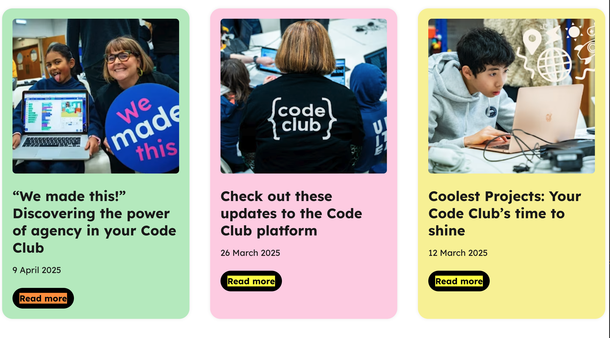

### What am I looking at here? 🤔

Welcome to Henry's Raspberry-Pi Website Audit! 🕵️

I'm genuinely excited about applying for the Software Engineer role at Raspberry Pi. To show what I bring, not just technical skills but enthusiasm and dedication, I've put together this personal audit as a way of demonstrating my willingness to go above and beyond.

While researching the role and the company, I used my frontend development experience and deep knowledge of Web Vitals to explore the Raspberry Pi Foundation and LLC websites. This presentation highlights some of the things I observed and my ideas on how improvements could be made.

This audit is by no means an extensive list of bugs/issues, but just a few of the higher priority issues I found over a few hours of research.

**A quick note:** My intention isn't to criticize or judge. I have the utmost respect for the talented team already working on these sites. This audit is simply my way of demonstrating my passion and going the extra mile to make my application stand out!

### Love the enthusiasm! How does this work?

The featured information on this page will be broken down into the following categories:

- Technical Performance
- GDPR
- Security
- SEO
- UX

For each issue I present, I'll explain where I found it, provide context on the problem, and offer a suggested solution.

If I'm successful in joining the Raspberry Pi team, I'm excited to tackle these challenges and put my ideas into action!

### What's the scope of this audit? 🔎

All of the information I've gathered I found by personally inspecting the following domains and some of the related subdomains.

- https://www.raspberrypi.com/
- https://www.raspberrypi.org/
- https://projects.raspberrypi.org/
- https://codeclub.org/
- https://codeclubworld.org/
- https://astro-pi.org/
- https://experience-ai.org/

I understand that some of the domains I reviewed are operated by the Raspberry Pi Foundation, while others belong to Raspberry Pi Ltd. These entities operate independently and don't necessarily have oversight over each other. However, for the purpose of this audit, I included all related websites in a broad, exploratory effort to identify as many opportunities for improvement as possible.

### Before we begin...

I want to acknowledge the impressive work done by the teams at Raspberry Pi. Their websites are exemplary models of clean design, solid HTML structure, accessibility, and SEO practices. Every page I visited showcased great attention to detail, making it a challenge to find areas for improvement. Kudos to everyone involved!

Of course, I needed to identify some points for discussion, so let's dive in!

---

<h2 class="audit" id="audit">The Audit</h2>

Before we delve into this audit, I would like to express that I am aware of the complexity of managing a diverse range of websites, from storefronts to blogs and educational platforms. Each decision behind their development likely has its rationale, which I may not be aware of from my external perspective.

The following points are based on a surface-level examination and should be viewed as a demonstration of my skills rather than a critique. My goal is to provide constructive insights, not to imply any shortcomings in the current setup.

## 1. Technical Performance ⚙️

First off, let me just say: Wow! The average Lighthouse scores across most of the sites I reviewed were truly impressive, mostly in the 95% range! Great job 👏 It took some patience and tenacity, but I did manage to find a few standout issues worth mentioning.

The data I used comes from two sources. First, I ran lab-based audits using Chrome Lighthouse. I'm aware that Lighthouse lab data can sometimes give a skewed view of real-world performance since it simulates conditions in a controlled environment. To balance that, I also analyzed anonymous user experience data from Google's Chrome User Experience Report [(CrUX)](https://developer.chrome.com/docs/crux), which reflects real user metrics collected from millions of Chrome users in the wild.

### Large Resources Blocking Render Time

<p class="found">Discovered on: https://projects.raspberrypi.org/en</p>

<figure align="center"><figcaption>Uh-oh!</figcaption></figure>

**Problem:**  
Large resources requested during page load can block the browser from rendering visible content until fully downloaded, parsed, and executed. On the landing page for [projects.raspberrypi.org](https://projects.raspberrypi.org), one of the earliest loaded resources is:

`https://editor-static.raspberrypi.org/releases/v0.28.14/web-component.js`

According to the Lighthouse Treemap tool, this file is a massive **18 MB**, a size that can significantly delay page rendering.

#### What is this file?

My research led to me the conclusion that this script is the Raspberry Pi Code Editor web component, as detailed in the [editor-ui GitHub repository](https://github.com/RaspberryPiFoundation/editor-ui). providing a modular, embeddable code editor that other sites can integrate using the `<editor-wc>` custom element.

<figure align="center"><figcaption>18mb Resource</figcaption></figure>

What I noticed was that the resource is loaded on every page, including the landing page, regardless of a need for the editor or not. On a lot of modern, powerful devices with good internet speeds the loading time for the page may be negligible, but this could really impact the user experience for someone using an older / inexperienced device. Considering that this is a primary website for education it would be a huge shame for any user to be disadvantaged by painfully slow rendering times!

**Solution:**  
Without full insight into the component's inner workings, I can only offer assumption-based suggestions to improve resource loading, assuming optimizations aren't already in place:

1. **Defer loading** by lazy-loading the script only when absolutely necessary. This can significantly reduce initial page render time. If the script isn't critical for first render, simply adding the `async` or `defer` attributes to the `<script>` tag can help, as explained in the [Chrome Developer Docs](https://developer.chrome.com/docs/lighthouse/performance/render-blocking-resources/?utm_source=lighthouse&utm_medium=devtools#how_to_eliminate_render-blocking_scripts).

2. **Code-splitting:** Given the file's large size, splitting it into smaller chunks that load on demand can greatly improve performance.

3. **Proper caching:** Ensure the file is cached effectively to avoid impacting repeat page loads. While inspecting the network request, I noticed the file size drops to just 149 bytes on subsequent loads, indicating caching is working well, nice!

4. **Optimize work on the main thread:**  
   Break long tasks into smaller chunks, use Web Workers for background processing, and use optimized code patterns like async/await, callbacks and promises to avoid blocking the main thread.

In general, it's best to minimize blocking code, especially external scripts. For smaller scripts, inlining the code directly into the page can avoid extra network requests altogether.

<figure align="center"><figcaption>Performance under optimal conditions</figcaption></figure>

Investigating the `Performance` panel in Chrome DevTools reveals the direct impact of the large `web-component.js` on render and code execution time. The call stack shows this script blocking other scripts for a total of **270ms**. While this may seem minor, it's measured under optimal conditions and can be worse in real-world scenarios.

<figure align="center"><figcaption>Performance under throttled conditions</figcaption></figure>

If I set the CPU throttling option to 4x, it takes a whole 1.17 seconds just for this one large script!

### Largest Contentful Paint (LCP)

<p class="found">Discovered on: https://projects.raspberrypi.org/en</p>

**Problem:**
Inspecting the CrUX report for March 2025 reveals insights into three key Web Vitals metrics that impact SEO performance and visibility.

- CLS and INP Performance: Both metrics are performing well, which is great!

- LCP Performance: Unfortunately, the LCP score tells a different story. Only 50% of users experience what Chrome considers a "good" score. For mobile users, the situation is even worse. Low LCP scores indicate that main content takes too long to become visible, leading to frustration, reduced engagement, and higher bounce rates.

<figure align="center"><figcaption>Core Web Vitals scores</figcaption></figure>

A pretty cool new feature offered by the CrUX dashboard is a useful visual graph for Web Vital trends.

<figure align="center"><figcaption>CrUX Score Visual Graph</figcaption></figure>

This graph shows an upward trend in LCP scores over the past year. Notably, in February this year, 75% of Chrome users experienced an LCP wait time of nearly 6 seconds on average.

#### Okay, Okay, enough about the problem, what's the solution here?

**Solution:**
While it is a tricky challenge for me to pinpoint the exact cause without more details, here are some general recommendations I can offer:

1. **Reduce Network Request Payloads:**
   Minimize large network requests, as previously discussed.

2. **Optimize Image Formats:**
   Switching to modern formats like WebP can significantly reduce image file sizes. The projects site currently uses PNGs, but Lighthouse suggests that using WebP could save up to 1/3rd on image requests due to its higher compression efficiency.

<figure align="center"><figcaption>Image Size Savings Prediction</figcaption></figure>

3. **Preload Critical Resources:**  
   Use the `rel="preload"` attribute on `<link>` tags in the page `<head>` to prioritize loading of resources that affect above-the-fold content. I noticed this was only applied to Google Fonts, so expanding its use to other key assets could improve LCP.

4. **Ensure LCP Resources Are Discoverable in HTML:**  
   If images or other key elements are dynamically added or lazily loaded via JavaScript, it can hurt LCP scores. Resources loaded externally are prime candidates for `rel="preload"` to help the browser prioritize them early.

5. **Leveraging a Content Delivery Network (CDN):**  
   Using a CDN helps distribute content globally, reducing latency and speeding up resource delivery. I assume this is already in place, but it's worth confirming.

## 2. GDPR 

For this task I used the [EDPB Website auditing tool](https://www.edpb.europa.eu/our-work-tools/our-documents/support-pool-expert-projects/edpb-website-auditing-tool_en),

In the spirit of full transparency, GDPR is a topic that I am very familiar with in my previous positions so I understand how crucial it is to be on the right side of these changes in digital privacy law. I also understand that every region, including the UK has a different take on GDPR as well as how costly & time consuming it is to adhere to new regulations thus why a lot of websites aren't always quick to adopt new changes.

That being said, I personally think that protecting the rights & privacy of users is the most paramount of issues and any infraction on them should have the highest priority in order to avoid expensive legal fines!

**Disclaimer:** This is not to be considered as legal advice, but my own opinion based on professional experience.

### Sending Requests To Third Parties Before Consent
<p class="found">Discovered on: All Pages</p>

Okay, this is a big one so lets get into it!

**Problem:**
Third Party resources are being loaded before **before user consent is given**!
When visiting any of the Raspberry Pi affiliated pages that I've inspected, network requests are being sent to Google Analytics / Google Tag Manager on the very first page load. Whilst these are trusted and verified third party sources the danger here is when loading them, especially scripts that run code on your page, you may not have full control over what that code does and user data can be leaked before the user has even provided any consent which could cost your data privacy officer a lot of sleep! There have been instances in the past where the European courts ruled that Google Analytics's privacy safeguarding measures were invalid and any sites submitting user data were essentially "exporting" user data to a "third country" (the US). Your CMP has an [article](https://usercentrics.com/knowledge-hub/google-analytics-and-gdpr-compliance-rulings/) on this very issue

<figure align="center"><figcaption>Analytics requests in network tab</figcaption></figure>

GDPR dictates that users must provide consent before setting any 'non-essential' cookies or collecting user data. Google Analytics does not fall under the essential category. Upon inspection of the _network tab_ it's apparent how many requests are being sent to Google Analytics and Google Tag Manager. In the _applications tab_ you can see the `_ga` cookies that have been set, all before any consent has been submitted.

<figure align="center"><figcaption>Third Party Cookies in application tab</figcaption></figure>

**Solution:**
The simple answer to this one is to ensure that your requests for third-party resources only takes place after user's have provided consent. 
Whilst the reality may be more complicated, it's usually a lot less painful than this sounds. You already have a cookie-consent banner in place on your page provided by Cookiebot (Usercentrics), so this is a great start!

Your Consent Management Platform (CMP) will typically have provided you with a SDK that gives you access to API tools that allow you to manage user consent. These API's have a few different methods for letting you manage your third-party scripts based on user consent. I personally have a lot of experience with helping digital publication companies clean up their pages to not send any requests before a signal provided by the user to give consent, and specifically with your CMP, Usercentrics. I will quickly outline the process they recommend, which you can read about in detail on their [docs](https://docs.usercentrics.com/#/direct-implementation-guide?id=assign-a-data-attribute)

Cookiebot/Usercentrics provides a simple system for deferring loading third-party resource requests by altering the HTML tags that encapsulate the code responsible for triggering those requests. All you need to do is change the `type` attribute on a script tag from `type="text/javascript"` to `type="text/plain` and then include a special attribute that will be picked up by the Cookiebot API `data-usercentrics="name of data processing service here"`. The exact names of the services (such as Google Analytics) can be found on your CMP dashboard, under "Settings", then the section named "Data Processing Services". Please be careful that the casing and spaces of the service must be exactly the same! So if the service is "Facebook Pixel" then the attribute should look like `data-usercentrics="Facebook Pixel"`

I've provided a simple example of what a script on your page may look like before and after modifications:

```html
<!-- Before Modification -->
<script
  async
  type="text/javascript"
  src="https://www.google-analytics.com/analytics.js"
></script>

<!-- After Modification -->
<script
  async
  type="text/plain"
  data-usercentrics="Google Analytics"
  src="https://www.google-analytics.com/analytics.js"
></script>
```

Now the code responsible for loading these requests will only run **after** a user has provided consent. Nice & easy!

**Bonus:** Requests to Google Fonts have also fallen afoul of European GDPR rulings, so it's advised to self-host your font files and have your page request that resource from a first-party domain on your server. 

## 3. Security 🔐

Pentesting & investigating vulnerabilities is a job with a large scope and takes considerable time & resources, so I wouldn't say that I've been able to give all the sites a thorough investigation but from what I've seen you've done an amazing job! Considering that Raspberry Pi is an educational charity, I'm sure the safety and privacy of users/students is the first thing on your mind. So well done! The only things I could suggest are very social level, so let's have a quick look over them:

### Strict Transport Security Header is not set
<p class="found">Discovered on:</p>
<ul class="found">
<li>https://www.raspberrypi.org/</li>
<li>https://projects.raspberrypi.org/en/projects</li>
<li>https://codeclubworld.org/</li>
<li>https://experience-ai.org/en/</li>
<li>https://astro-pi.org/</li>
</ul>


**Problem:** 
The HSTS (Https Strict Transport Security) header is a security feature that tells browsers only to connect to a site over HTTPS once that connection has been established, and never HTTP. This is more secure and prevents Man-In-The-Middle attacks in the circumstance that someone visits your site over HTTP (even if a website has enabled HTTPS), as their initial connection would be unencrypted. There are multiple vectors through which a user may end up making a HTTP connection instead, some of which are explained in great detail on [cio.gov](https://https.cio.gov/hsts/).

<figure align="center"><figcaption>No Strict Transport Security header in response</figcaption></figure>

**Solution:**
You need to configure your web server to include the Strict-Transport-Security header in all HTTPS responses. A typical value is:

```bash
Strict-Transport-Security: max-age=31536000; includeSubDomains; preload
```
This header now tells browsers to remember to connect over HTTPS for one-year (31536000 seconds), apply this rule to all subdomains for this site and allow for your site to be submitted to browser's 'preloading' list (this is optional but recommended)


## 4. SEO 🔎 🕸️

For this section I used the [SiteOne Crawler Report tool](https://crawler.siteone.io/), [Screaming Frog SEO Spider](https://www.screamingfrog.co.uk/seo-spider/), Chrome Lighthouse reports as well as manually inspecting the pages.

Overall, the sites scored exceptionally well on SEO, with most achieving perfect 100s in Lighthouse! The issues I found were generally minor, whilst it may seem overly judicious to include them, I decided to nonetheless to demonstrate my attention to detail.

### Missing H1 Tag

<p class="found">Discovered on: https://projects.raspberrypi.org/en</p>

**Problem:**  
H1 tags are crucial for signaling the primary topic of a page to search engines. On this landing page, the absence of an H1 tag could negatively impact indexing and ranking. Although modern search engines can somewhat mitigate this issue, best practices recommend having only one H1 tag per page to clearly define the page's main heading.

<figure align="center"><figcaption>Missing H1 Tag</figcaption></figure>

**Solution:**  
Replace the `<p>` tag with the class "page-section\_\_title" with an `<h1>` tag. This ensures that the page has a clear, semantically correct main heading, enhancing SEO and accessibility.

### Multiple H1 Tags

<p class="found">Discovered on: https://codeclubworld.org/</p>

**Problem:**  
Having multiple `<h1>` tags on a single page can confuse search engines about the page's primary topic, potentially diluting SEO value. It can also impact accessibility, making it harder for screen readers to navigate and understand the content hierarchy.

**Context:**
Whilst Google has clarified that having multiple `<h1>` tags does not inherently harm SEO, it is still considered best practice to use a **single `<h1>`** per page.

<figure align="center"><figcaption>Multiple H1s</figcaption></figure>

**Solution:**
Ensure the primary heading of each page is enclosed within a single `<h1>` tag, with subsequent headings using the appropriate hierarchical tags (`<h2>`, `<h3>`, etc.) to maintain clear structure.

**Bonus:**
The Screaming Frog SEO Spider crawl revealed that the raspberrypi.org blog articles frequently contain multiple `<h1>` tags per post.

<figure align="center"><figcaption>Multiple H1s On Every Page</figcaption></figure>

On the blog page, the container has its own sub-header with the text "Blog" set as an `<h1>` tag. This conflicts with the `<h1>` tags used for individual blog article titles, creating multiple top-level headings on the same page. My personal recommendation would be to change the sub-header to a tag with less hierarchical value.

<figure align="center"><figcaption>Blog H1s</figcaption></figure>

### Missing Meta Description

<p class="found">Discovered on: https://codeclub.org/en</p>

**Problem:**
The only description meta tag on this page is the Open Graph tag `og:description`, which is used by social media platforms like Facebook and LinkedIn to display page summaries when shared. While necessary, this tag serves a different purpose than the standard `name="description"` meta tag, which search engines use for indexing and displaying snippets in search results.

```html
<meta
  content="We believe in learning through making, and Code Clubs use our free coding projects and resources to offer young people plenty of opportunities to be creative, learn a new skill and connect with others."
  property="og:description"
/>
```

**Solution:**
Add a standard meta description tag alongside the Open Graph tag by duplicating it and changing property="og:description" to name="description". For example:

```html
<meta
  name="description"
  content="We believe in learning through making, and Code Clubs use our free coding projects and resources to offer young people plenty of opportunities to be creative, learn a new skill and connect with others."
/>
```

### Non Descriptive Link Texts

<p class="found">Discovered on: https://codeclub.org/en</p>

**Problem:** The [Google Dev Docs](https://developer.chrome.com/docs/lighthouse/seo/link-text/?utm_source=lighthouse&utm_medium=devtools) outline the issue in detail. Put simply, when the displayed text inside of a link isn't descriptive, both users & search engines won't necessarily understand the relation between the pages being linked.

<figure align="center"><figcaption>Read More Links</figcaption></figure>

**Solution:** This task may require some tweaking depending on how the articles are titled, but the fix is simple: include some relevant information in the link description like so:

```html
<a href="article-url">Read more about [Article Title]</a>
```

## 5. UX 👥

### Offer Dark Mode for users

**Problem:** 
The Raspberry Pi sites do not currently offer an option to users for switching color themes.

A great option to offer users on modern devices is allowing them to select between light & dark color themes for your site. Many users (myself included) prefer dark mode themes as it reduces eye strain with fewer high contrast, bright pages especially when reading at night. Dark themes also tend to save battery on mobile devices, enhances readability and many more benefits.

**Solution:**
Now whilst this can require some work to implement and get the balance correctly, it's always a welcome benefit that improves comfort and accessibility that makes your site more user-friendly and inclusive. The good news is that a lot of your sites already utilise a color palette that lends well to being modified for a dark theme.

I took the liberty of extracting the color palette from the homepage of [https://www.raspberrypi.org/](https://www.raspberrypi.org/) and generating a CSS palette through [coolors.co](https://coolors.co). 

<ul style="list-style: none; padding: 0;">
  <li><span class="palette-color" style="background:#474747ff;"></span>outer-space: #474747ff</li>
  <li><span class="palette-color" style="background:#ffffffff;border:1px solid #ccc;"></span>white: #ffffffff</li>
  <li><span class="palette-color" style="background:#ca2456ff;"></span>rose-red: #ca2456ff</li>
  <li><span class="palette-color" style="background:#020202ff;"></span>black: #020202ff</li>
  <li><span class="palette-color" style="background:#bcbcbdff;"></span>silver: #bcbcbdff</li>
  <li><span class="palette-color" style="background:#28ba86ff;"></span>mint: #28ba86ff</li>
  <li><span class="palette-color" style="background:#93866fff;"></span>beaver: #93866fff</li>
  <li><span class="palette-color" style="background:#f1d752ff;"></span>naples-yellow: #f1d752ff</li>
  <li><span class="palette-color" style="background:#5155afff;"></span>violet-blue: #5155afff</li>
  <li><span class="palette-color" style="background:#84f16eff;"></span>screamin-green: #84f16eff</li>
</ul>


I will detail a simple explanation of how you can create color palettes using semantic tokens that will let you easily swap the theme by changing the value of these tokens.
First we will start by establishing the CSS palette variables and the light theme (the base):

```css
:root {
  /* Palette base */
  --outer-space: #474747ff;
  --white: #ffffffff;
  --rose-red: #ca2456ff;
  --black: #020202ff;
  --silver: #bcbcbdff;
  --mint: #28ba86ff;
  --beaver: #93866fff;
  --naples-yellow: #f1d752ff;
  --violet-blue: #5155afff;
  --screamin-green: #84f16eff;
  /* Light Theme (default) */
  --color-background: var(--white);
  --color-surface: var(--silver);
  --color-primary: var(--rose-red);
  --color-secondary: var(--mint);
  --color-accent: var(--naples-yellow);
  --color-info: var(--violet-blue);
  --color-success: var(--screamin-green);
  --color-warning: var(--naples-yellow);
  --color-error: var(--rose-red);
  --color-text: var(--outer-space);
  --color-muted: var(--beaver);
  --color-border: var(--silver);
}
```
Here you can see that we have established a color palette using the colors on your website. Each color is assigned a token, and that css token variable is applied to a set of variables for a light theme. Now we will rearrange how the color variables are applied to the theme variables for the dark theme: 
```css
[data-theme="dark"] {
  --color-background: var(--outer-space);
  --color-surface: var(--black);
  --color-primary: var(--mint);
  --color-secondary: var(--rose-red);
  --color-accent: var(--violet-blue);
  --color-info: var(--naples-yellow);
  --color-success: var(--screamin-green);
  --color-warning: var(--naples-yellow);
  --color-error: var(--rose-red);
  --color-text: var(--white);
  --color-muted: var(--silver);
  --color-border: var(--beaver);
}
```
Now we can apply these theme variables to your page elements, such as buttons, text, containers and so on. As an example you can see that for a page background element, the `--color-background` variable in the light theme will use the `--white` variable and in the dark it is `--outer-space`.

You may have noticed this part of the CSS code: `[data-theme="dark"]`. This CSS selector makes the job of switching themes super easy for us! In the HTML document, all we need to do is apply the special data-attribute to an element (usually the `<body/>` or `<html/>`) so when this attribute is applied the CSS rules for the dark theme will kick in! The HTML will look like this:

```html
<body data-theme="dark">
  <!-- Your content here -->
</body>
```

In order to apply this data-attribute, it can be easily achieved via a button that the user toggles. When the button is toggled it will run the code responsible for applying/removing that data attribute. Here is a demonstration:

```html
<button id="toggle-theme">Toggle Dark Theme</button>

<script>
  const btn = document.getElementById('toggle-theme');
  btn.addEventListener('click', () => {
    // Toggle the data-theme attribute on <body>
    if (document.body.getAttribute('data-theme') === 'dark') {
      document.body.removeAttribute('data-theme');
    } else {
      document.body.setAttribute('data-theme', 'dark');
    }
  });
</script>
```

Voila! You now have a simple dark/light theme mode ready to go! Obviously implementing this will take a lot of careful consideration and UI testing on each of your sites as they vary in palette, use case and audience. 

I also took the liberty of playing around with the source code of the homepage in the dev-tools to demonstrate what a dark-mode would look like. Obviously the logo in the header would need adjusting to display white text instead of black in this circumstance

<figure align="center"><figcaption>Dark Theme Example</figcaption></figure>


### Youtube embeds overflow on small screens
<p class="found">Discovered on: https://projects.raspberrypi.org/en/projects/blender-animate-snow-scene</p>

**Tested on:**
- Google Pixel 8 - Chrome for Android
- Macbook Air M1 - Chrome, Opera, Firefox, Safari


**Problem:** Due to the fixed width attribute on the YouTube embed video iframe element, on smaller screens part of the video window overflows on the X-Axis. This means that some of the controls are unaccessible and part of the video is cropped. This would force the viewer to have to leave the site and watch the video on the YouTube app. I understand that the YouTube embed code comes like this for default as they want to ensure that their videos are displayed at a 16:9 aspect ratio, and will leave any extra CSS responsiveness demands up to site owners.  

<figure align="center"><figcaption>Youtube Embed Overflowing</figcaption></figure>

**Solution:** 
Wrap the iframe in a container and use CSS to maintain the aspect-ratio and also allow resizing. Here is an example of the CSS you could use to fix your embeds:

```css
@media screen and (max-width: 560px) {
  .video-container {
    padding-bottom: 56.25%; // This trick ensures the video container stays in 16:9 aspect ratio. 56.25% of the video width is used to calculate the height.
    position: relative;
    height:0;
    overflow: hidden;
  }
  .video-container iframe {
    left: 0;
    top: 0;
    height: 100%;
    width: 100%;
    position: absolute;
  }
}
```
and wrap your embed with the container like so:

```html 
<div class="video-container">
    <iframe width="560" height="315" src="https://www.youtube.com/embed/O7gS6nbyyvE" frameborder="0" allowfullscreen=""></iframe>
</div>
```

I've provided an example of this below that you can test with the dev-tools mobile view / on actual phone screens.

<div class="video-container">
   <iframe width="560" height="315" src="https://www.youtube.com/embed/O7gS6nbyyvE" frameborder="0" allowfullscreen=""></iframe>
</div>

---

## Finishing Thoughts

Congrats on making it to the end of my presentation! 🥳 
Thank you so much for reading, I hope you enjoyed it as much as I did putting it together. 

As I've previously stated, my only ambition was to make my application for the software engineer role stand out from the others. The knowledge and skills I have displayed here are only a small fraction of my capabilities, and this is only from a surface level investigation of the frontend, I am also a full stack developer with extensive backend experience!

I'm available at your convenience to discuss any of the issues presented here, the job opportunity or just a general chat about whatever takes your fancy! 
You can find links to my email and phone contacts as well as my Github and LinkedIn pages in the header and footer of this page. 


Thank you for visiting!
I look forward to hearing from a member of the Raspberry Pi team soon (I really, really can't wait! 😅)

Sincerely excited,
<p class="sign-off-name">Henry Crookes</p>